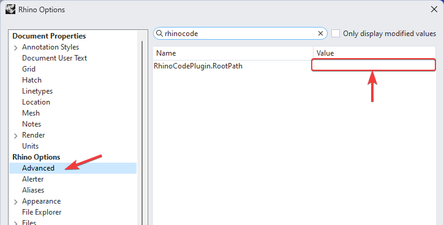

+++
title = "Scripting Languages Initialization"
description = "This guides covers initialization process of various language runtimes"
type = "guides"
categories = ["Scripting"]
keywords = [ "initialize", "rhinocode" ]
languages = [ "C#", "Python", "CPython", "IronPython", "VB" ]
authors = ["ehsan"]
sdk = [ "RhinoCommon" ]
weight = 4

[included_in]
platforms = [ "Windows", "Mac" ]
since = 8

[page_options]
byline = true
toc = true
toc_type = "single"
block_webcrawlers = false
+++

## Scripting Root Directory

All languages initialize their runtimes under the scripting root directory. This is usually placed under:

- `%USERPROFILE%\.rhinocode` on Window
- `~/.rhinocode` on macOS (and other Unix-like)

For example, in Rhino 8, Python 3 (CPython) and Python 2 (IronPython) deploy their runtimes and modules under these directories respectively:

- `~/.rhinocode/py39-rh8/` for Python 3 
- `~/.rhinocode/py27-rh8/` for Python 2

Alongside language runtimes, root directory also holds:

- `logs/` for application log files
- `stage/` for temporary scripts
- `libs/` for cache for script libraries
- `component.json` for configurations for Script Components
- `editor.json` for configurations for Script Editor

### Changing Root Directory

It is sometimes necessary to change the location of this directory. As mentioned above, Python 3 deploys its runtime in the scripting root directory and needs to run Python executive binary (`python.exe` on Windows) to start the language server and install packages from PyPI.org

If this is something you need to block for security reasons, you can change the scripting root directory to a different location with execute priviledges.

To change the scripting root directory:

- Open Rhino
- Do not interact with the scripting tools, meaning do not open ScriptEditor, Grasshopper, and do not run RunPythonCommand
- Go to **Rhino -> Tools -> Options -> Advanced**, and override the default empty value of `RhinoCodePlugin.RootPath` with your desired root directory path. This needs to be an absolute path and must be writable with execute priviledges for user running Rhino
- Close and Reopen Rhino
- Open ScriptEditor and let it initialize languages in this new root directory
- Open Grasshopper and drop a Script component on the canvas so the `component.json` file is also created in root directory

### Resetting Root Directory

To change the scripting root directory back to default, clear the override set on `RhinoCodePlugin.RootPath` in **Advanced** options as shown above.