+++
title = "ScriptEditor Command"
description = "This guide provides an overview on how to edit and run scripts inside of Rhino"
type = "guides"
categories = ["Scripting"]
keywords = [ "", "" ]
languages = [ "C#", "Python", "CPython", "IronPython", "VB" ]
authors = ["ehsan"]
sdk = [ "RhinoCommon" ]
weight = 4

[included_in]
platforms = [ "Windows", "Mac" ]
since = 8

[page_options]
byline = true
toc = true
toc_type = "single"
block_webcrawlers = false
+++

<style>
    .main-content img { zoom: 50%; }
</style>

## Opening Script Editor

To access the unified script editor in Rhino, type `ScriptEditor` in the command prompt and hit enter to run the command:


If this is the first time you are using the scripting features in Rhino, the editor will immediately start initializing the languages. Setting up Python 3 ([CPython](https://www.python.org)) environment is the most important and normally the longest task here. The editor will display a progress bar, showing each initialization task. All editor features are disabled at this point so you should wait for the initialization process to complete.


Once the initialization is complete, the editor will load all the previously open scripts (of any), and will enable the buttons and menus:


## First Script

Let's create our first script. We will use IronPython for this example. From the "Dashboard" (row of buttons at the top of the editor window), click on the **New** button and choose "Iron Python" to create the first script:

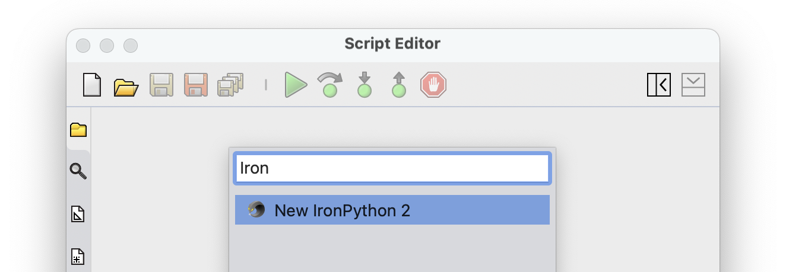

The default script contains a good amount of information under the `NOTES:` multiline comment (or *docstring*). We can skip that for now as we will discuss these more advanced topics later in this guide. Let's remove those comments.


Click on the **Save** button on the Dashboard to save the script:

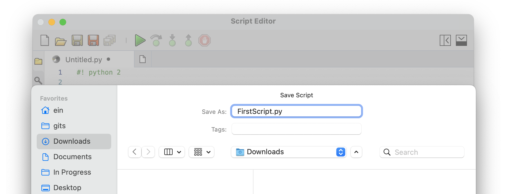

## Edit Script

Let's type a new line at the bottom of the script. The editor will help autocompleting the names:

```python
print(Rhino.RhinoApp.Version)
```

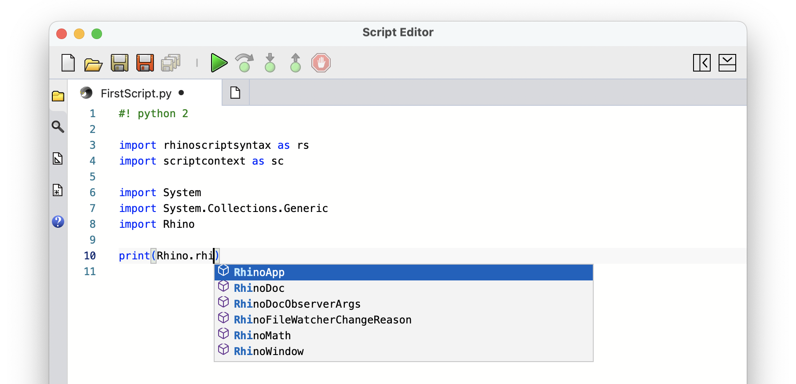


The script tab showing the name of the script (`FirstScript.py`) in this example, now shows a dark circle by the name denoting that the script has been modified but not saved.


## Running Scripts

Click on the green **Run** button on the Dashboad (or hit **F5**) to run the script. The only line in our script that produces a result is the `print` statement. This will print the version of Rhino we are using in the terminal. Click on the **Terminal** tab a the bottom of the screen to open up the terminal tray and see the printed results.

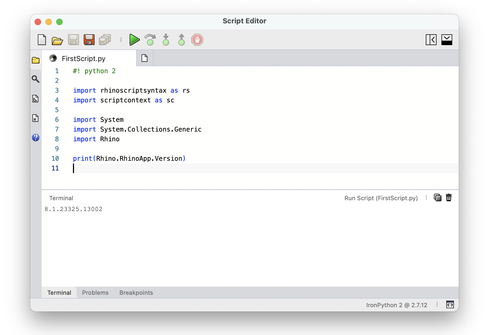

The Terminal tray has a series of buttons on the top-right side to **Copy** and **Clear Contents** of terminal. Most panels and trays in the editor follow the same design and have buttons for most used actions on the top-right corner.


## Debugging Scripts

The script editor can debug scripts of any supported language. During debug, we can execute the script line by line, or pause the execution at certain lines called **Breakpoints** and inspect the values of global and local variables.

Let's add these lines to our script:

```python

total = 0
for i in range(5):
    total += i

```


Move your mouse cursor to the left side of the line number column on line 12 and click. This should add a red dot and mark that line as a **Breakpoint**. Lets do the same for line number 14:


The **Breakpoints** tray at the bottom will show all the active breakpoints, and will provide buttons to Clear or Toggle all of them or individual breakpoints:

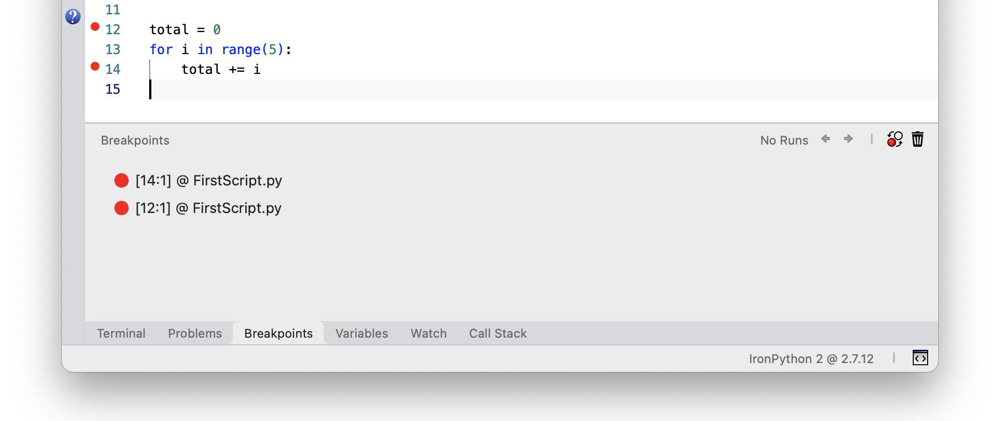

When breakpoints are added, editor makes a few UI changes and provides a few more utilities for debugging:

- The **Run** button will change to **Debug**
- **Variables**, **Watch**, and **Call Stack** trays will be added to the bottom tray bar

Now click on the green **Debug** button on the Dashboard. The editor will run the script and will:

- Stop at the first breakpoint on line 12
- Highlights the breakpoint line in orange and shows an arrow on the left side of the line
- Highlights Status Bar in orange to show we are debugging a script
- Activates the debug control buttons on the Dashboard
- Opens the **Variables** tray at the bottom to show global and local variables


We can control the execution of script using the debug control buttons on the Dashboard:


From left to right, the are:

- **Continue:** continues running the script until it stops on another breakpoint
- **Step Over:** executes current line and moves on the next line
- **Step In:** if the current line includes a function call, this will step into the lines defining the function code
- **Step Out:** if previously stepped into a function code, this will continue executing the function code until control is returned from the function to the calling code and will stop there
- **Stop:** stops debugging the script and does not continue executing the rest

Click on **Step Over** to see the execution move to the next line:


Click on **Step Over** one more time and script should stop on line 14. At this point the **Variables** tray will be showing the current values (and their data types) for `i` and `total` variables:


Progressively clicking on **Step Over**, will continue executing the script and modifying the variables. At each stop, **Variables** tray highlights the modified value by a red dot to left of the variable name:


Once the script ends, the editor UI changes back to normal, and the **Variables** tray will show the last state of the variables. The tray will keep these data until the script is closed or another session of debugging is started:

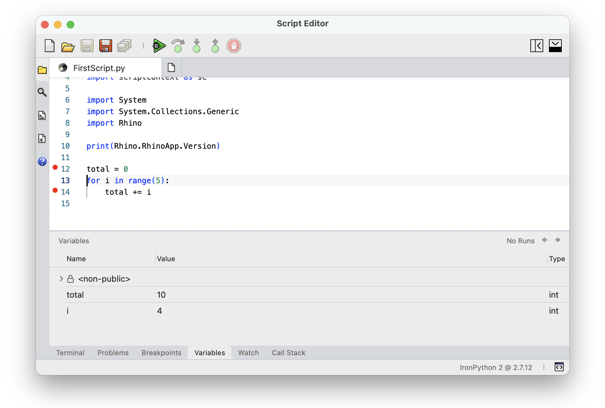

At any point in time, you can use the **Toggle** button in the **Breakpoints** panel to activate or deactivate the breakpoints. Deactivated breakpoints will show up as gray dots in the editor:


## Using Packages

### Python Packages

You can specify the packages required for your scripts inside the script source. This creates self-contained scripts that carry all their requirements with them.

- Python 3 will use **pip** to install packages from [PyPI.org](https://pypi.org)
  - **pip** does not support Python 2 anymore so we are limited to the packages used in IronPython
- C# will use **NuGet** to install packages from [NuGet.org](https://www.nuget.org)

The default script for each language has a NOTE section at the top that describes how to specify the requirements in your scripts. Looking at Python 3 default script, we can specify required packages using this syntax:

```python
# r: numpy
```

or 

```python
# requirements: numpy
```

Let's create a new Python 3 script and add `numpy` as a package and use that in our script:

```python
# requirements: numpy

import numpy

print(f"using numpy: {numpy.version.full_version}\n")

for i in numpy.random.rand(10):
    print(i)

```


Click Run, and the script editor will attempt to install the required packages before running the script. This process might take some time and the editor is going to be disabled. Once the packages are installed, editor will continue to execute the script:

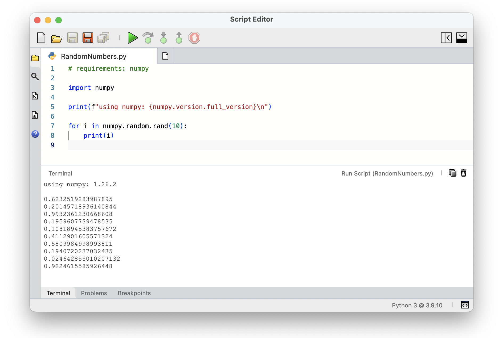

### Python Libraries (Modules)

Another method of adding local packages to python scripts is by adding their path to the `sys.path`. You can simpify this step by using the `# env:` specifier in your scripts to automatically add a path to the `sys.path` before running your script:

```python
# env: C:/Path/To/Where/My/Library/Is/Located/

import mylibrary

mylibrary.do_something()
```

### NuGet Packages

Same convention applies to C# scripts. They use a different syntax to specify packages that matches the format provided in NuGet.org page for the package you want to use:


Here is an example script that uses [RestSharp](https://www.nuget.org/packages/RestSharp/110.2.0) NuGet package to grab some data from a website. Note the first line of the script is specifying the **RestSharp** package version `110.2.0`

```csharp
#r "nuget: RestSharp, 110.2.0"
 
using System;
using System.Collections.Generic;
using Rhino;
 
using RestSharp;
using RestSharp.Authenticators;
 
var client = new RestClient("https://httpbin.org");
var request = new RestRequest("get");
var response = client.Get(request);
 
Console.WriteLine(response.Content);

```

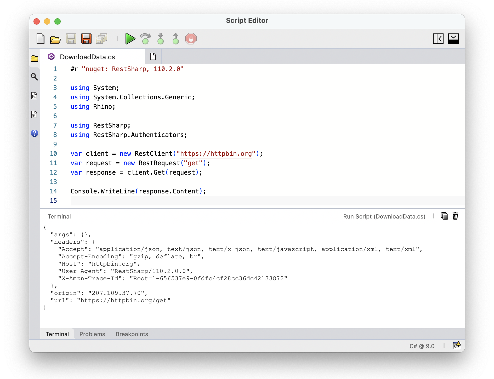

## Editor Features

Script editor has other noteworthy features. Here we highlight a few that are used more often:

### Explorer

Use the **Explorer** panel to the left of the editor window to browse and edit your local scripts. Click  **Explorer** tab to open the panel, and click on the folder icon on the top-right corner of the panel to browser to a folder:


Once a folder is set, explorer will show the scripts in that folder and all subfolders, and will activate a new set of buttons to manage the scripts:


### Search

Click on the **Search** tab to open the Search panel. Searching for a keyword will show all the matches for all the open scripts in the panel. You can click on any matched item to navigate to the script and line:


### Help

Click on the **Help** tab to open the Help panel. This panel provides a simple method to get help on Rhino and Grasshopper APIs and provided python modules:

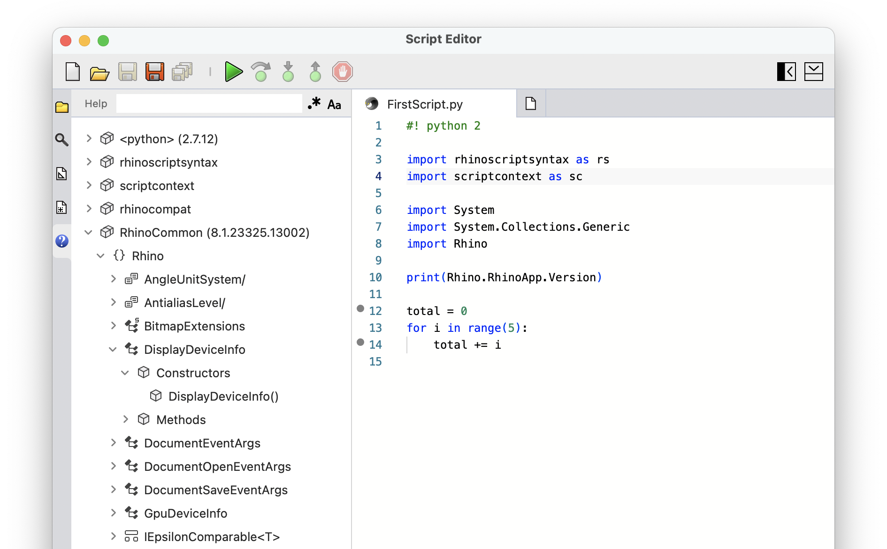

Use the search field to search for class or method names. The info panel at the bottom provides some info about the method and its parameters:

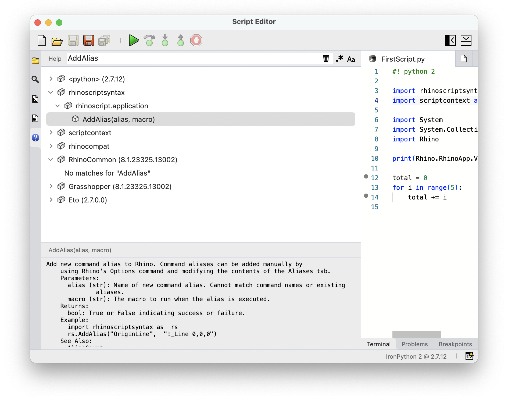

If the selected member has an online documentation, a preview tab opens in the editor showing the contents:

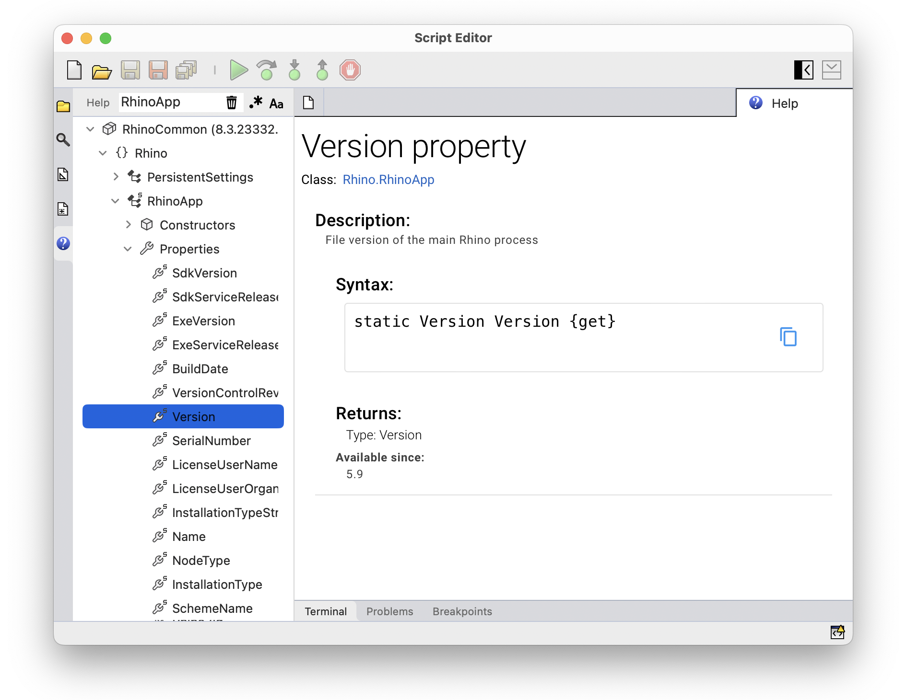
