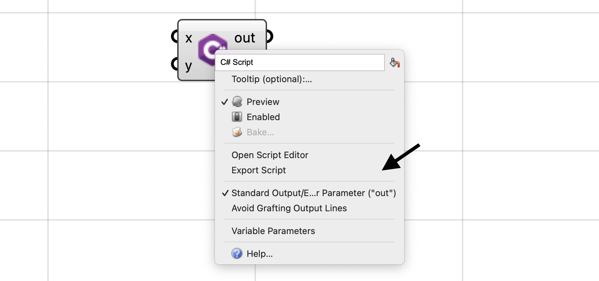
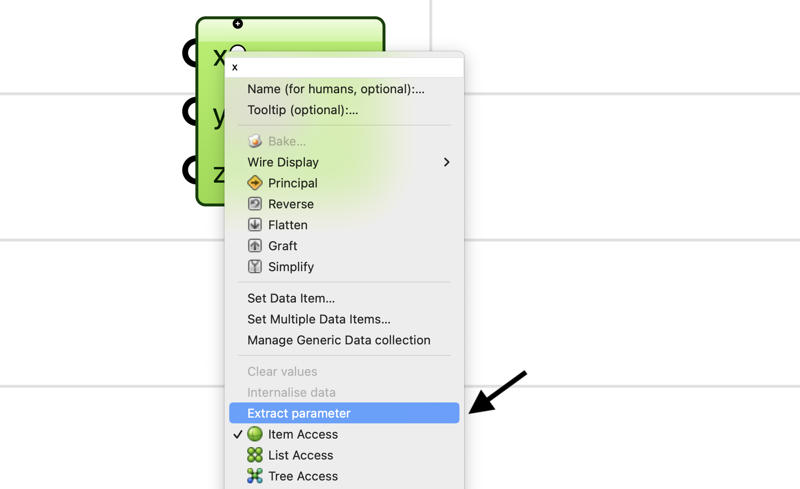
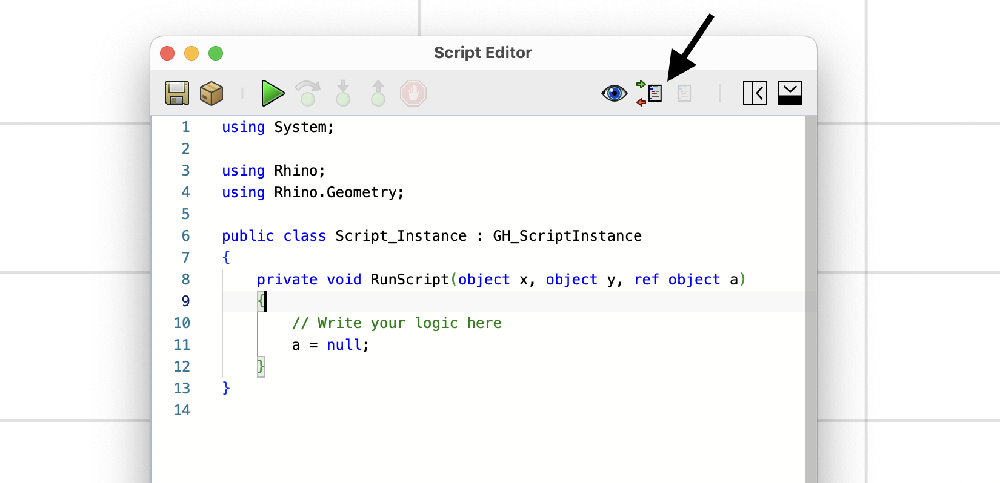
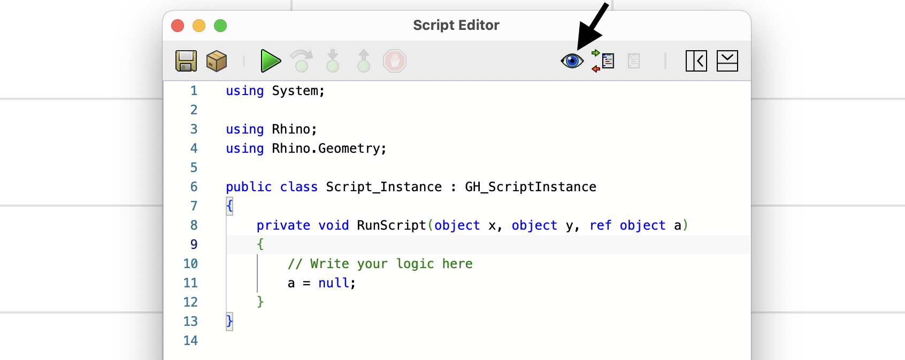

+++
title = "Grasshopper Scripting: C#"
description = ""
type = "guides"
categories = ["Scripting"]
keywords = [ "", "" ]
languages = [ "C#" ]
authors = ["ehsan"]
sdk = [ "RhinoCommon" ]
weight = 4

[included_in]
platforms = [ "Windows", "Mac" ]
since = 8

[page_options]
byline = true
toc = true
toc_type = "single"
block_webcrawlers = false
+++

<style>
    .main-content img { zoom: 50%; }
    code {
        background-color: #efefef;
        padding-left: 5px;
        padding-right: 5px;
        border-radius: 3px;
        font-size: 14px;
    }
</style>


This guide is meant to be a detailed reference on all the important aspects and features of the Grasshopper C# Script component. If you would like a quick introduction to the script component, please check out:

[Grasshopper Script Component](/guides/scripting/scripting-component)

This guide does not discuss Rhino or Grasshopper APIs either. So if you would like to know how to create complex geometries in Rhino and Grasshopper, please check out:

[Essential Guide to C# Scripting in Grasshopper - by Rajaa Issa](https://developer.rhino3d.com/guides/grasshopper/csharp-essentials)


## C# Component

Let's dive into C# scripting in Grasshopper by creating a Script component. Go to the **Maths** tab and **Script** panel and drop a C# Script component onto the canvas:


You can also use the generic Script component that can run any language, and choose C# from the [ ● ● ● ] menu:


### Opening Script Editor

Now we can double-click on the component to open a script editor. Note that the component draws a cone pointing to the editor that is associated with this component.


### Component Options

At any time, you can right-click on a script component to access a few options that would change how the component behaves. We will discuss all these options in detail below.



!!!!!!!!!!!!!!!!! preview enable bake

### Modern C#

Lorem ipsum dolor sit amet, consectetur adipiscing elit, sed do eiusmod tempor incididunt ut labore et dolore magna aliqua. Ut enim ad minim veniam, quis nostrud exercitation ullamco laboris nisi ut aliquip ex ea commodo consequat. Duis aute irure dolor in reprehenderit in voluptate velit esse cillum dolore eu fugiat nulla pariatur. Excepteur sint occaecat cupidatat non proident, sunt in culpa qui officia deserunt mollit anim id est laborum.


## Inputs, Outputs

The most important concept on a script component is the inputs/outputs. The **Script** component supports *Zoomable User Interface* (*ZUI* for short). TThis means that you can modify the inputs and outputs of the component by zooming in until the **Insert** [ ⊕ ] and **Remove** [ ⊖ ] controls are visible on either side:


By default a script component will have `x` and `y` inputs, and `out` and `a` as outputs. When all parameters on either side are removed, the component will draw a jagged edge on that side. This is completely okay as not all scripts require inputs or produce values on the other output:


Every time you add a parameter, a new temporary name is assigned to it. You can right-click on the parameter itself, to edit the name. It is good practice to assign a meaningful name to parameters so others can understand what kind of inputs to pass to your component or what these inputs are gonna be used for.


!!!!!!!!!!!!!!! performance of modifying parameters in C#


### Reserved Names

Every programming language has a set of reserved words (or keywords) that are used in its language constructs. For example in C#, the words `return`, `decimal`, or `default` are all reserved. The C# script component does not allow using any of these keywords for input or output parameters:


Check out [C# Keywords](https://learn.microsoft.com/en-us/dotnet/csharp/language-reference/keywords/) for more information on these keywords.

### Standard Output (out)

The `out` output parameter is special. It captures anything that the script prints to the console (`Console.WriteLine`). The captured output is passed to this parameter as one string or multiple strings (one for each line). The default behaviour is that each line being printed to the console, becomes one item in the `out` parameter:


You can control the single vs multi-line behaviour using the **Avoid Grafting Output Lines**. When this option is checked, all the console output will be passed as one single item to the `out` parameter.


!!!!!!!!!!!!!!! toggling this parameter

!!!!!!!!!!!!!!! tiny capture output overhead

### Type Hints

C# is a strongly-typed language. More often than not we need to define the types of inputs and outputs to be able to use all their associated features. For example, C# knows how to add two integers (`int`) together, so if we are going to add inputs in the script, we would need to define a type that supports the addition.

This is where *Type Hints* come into play. They define the type of input or output parameter while also act as data type converters. For example you can pass a *Line* to an input of type `integer` and the converter would capture the length of the line and pass that as the integer to the component. The conversions are identical to how Grasshopper parameters can convert to each other.

By default all inputs and outputs of a C# component have **No Type Hint** meaning they are defined as type `object` in the script. This provides a lot of flexibility but if you pass two integers to the default `x` and `y` inputs, this script below would fail as C# does not know how to add two `object`s to each other.

```csharp
a = x + y;
```


There are plenty of *Type Hints* to choose from. They are available on both input and output parameters:


Check out [Type Hints](/guides/scripting/scripting-gh-typehints) for more information on these type hints and their use cases.

### Parameter Access

--

### Extracting Parameters

Grasshopper allows extracting an input parameter from a component. Parameters on a component are independent entities that could exist as inputs or outputs on a component or as floating parameters ([Types of Parameters](https://developer.rhino3d.com/guides/grasshopper/simple-parameters/#types-of-parameters)).

You can extract a script input by choosing **Extract** from the right-click menu on the parameter:



If you have a *Type Hint* set on a parameter, the extracted floating parameter will be of that data type:


## SDK-Mode

There are two ways you can create a C# script in Grasshopper. The first and the easiest is to write a C# script in the simplest form. For example, if we want to pass the sum of our two `x` and `y` inputs to the `a` output, we would create C# script component with this script:

```csharp
a = x + y;
```

Note that we did not add and `using` statements to our script because we are only using builtin C# functionality here that is addition of two numbers.

However, a typical Grasshopper component can:

- Execute code *Before* component is asked to solve the inputs ([BeforeSolveInstance](https://developer.rhino3d.com/api/grasshopper/html/M_Grasshopper_Kernel_GH_Component_BeforeSolveInstance.htm))
- *Solve* the inputs and pass results to outputs ([SolveInstance](https://developer.rhino3d.com/api/grasshopper/html/M_Grasshopper_Kernel_GH_Component_SolveInstance.htm))
- Execute code *After* component is finishing solving the inputs ([AfterSolveInstance](https://developer.rhino3d.com/api/grasshopper/html/M_Grasshopper_Kernel_GH_Component_AfterSolveInstance.htm))
- Execute code to draw geometry wires on Rhino viewports ([DrawViewportWires](https://developer.rhino3d.com/api/grasshopper/html/M_Grasshopper_Kernel_GH_Component_DrawViewportWires.htm))
- Execute code to draw geometry meshes on Rhino viewports ([DrawViewportMeshes](https://developer.rhino3d.com/api/grasshopper/html/M_Grasshopper_Kernel_GH_Component_DrawViewportMeshes.htm))


The methods linked above are part of Grasshopper SDK for creating custom components. Every developer that creates a Grasshoper plugin is aware of these methods and might be using them to customize the component behaviour.

In a C# script component, we can implement our scripts in a similar manner. That is why we are calling it the SDK-mode as it provides similar functionality that is available in Grasshopper SDK to the scripts.

By default when you create a C# script component, the template script is already in SDK-mode as this is how C# components before Rhino 8 have been working and we kept it the same in Rhino 8 and above.

This is how the default script looks like (actual script might not be identical):

```csharp
using System;

using Rhino;
using Rhino.Geometry;

public class Script_Instance : GH_ScriptInstance
{
    private void RunScript(object x, object y, ref object a)
    {
        // Write your logic here
        a = null;
    }
}
```

`GH_ScriptInstance` is the base class that implements methods below, similar to Grasshopper components:

- `BeforeRunScript`: Execute code *Before* component is asked to solve the inputs
- `RunScript`: *Solve* the inputs and pass results to outputs
- `AfterRunScript`: Execute code *After* component is finishing solving the inputs
- `DrawViewportWires`: Execute code to draw geometry wires on Rhino viewports
- `DrawViewportMeshes`: Execute code to draw geometry meshes on Rhino viewports

This class provides base implementation for these methods except for `RunScript` that we must implement. In the example above, we subclass from `GH_ScriptInstance` and provide an empty implementation for `RunScript`.

### RunScript Signature

The `RunScript` method signature is going to include all the component inputs and outputs by their name and data type (based on their *Type Hints*). All outputs are passed by reference using `ref` keyword so that providing a value for them would be optional.

You can write the logic of your component inside the `RunScript` block, take the input values, compute, and set the outputs. As with any other Grasshopper component, the `RunScript` method might be call multiple times based on the pairing of input data.

### Before, After Solve Overrides

You can easily add the `BeforeRunScript` and `AfterRunScript` methods to your `Script_Instance` implementation by:

- Click on the **Add SolveInstance Overrides** button on the editor toolbar
- Click on the **Add SolveInstance Overrides** menu inside the **Grasshopper** menu on the editor
- Typing them yourself



These two methods will be added to the class implementation:



A good example of using these two methods would be to setup instance variables on the class instance during `BeforeRunScript` and clean them up after the execution during `AfterRunScript`. The component is not allowed to make changes to the output parameters inside these methods.


Each one of these methods is executed only once, per one full execution of this component. We can put a few print statements in these methods, and check the order of execution:


There are two range components included in this example to provide inputs to the script component. Each range component outputs 11 items, and their associated input parameter on the script component has a `double` *Type Hint* assigned to it. This means the `RunScript` method is going to be executed 11 times for 11 pairs of `x` and `y` from the two range components.

Notice that the text *BeforeRunScript* is printed on the same output item as *RunScript #0* which is the first iteration of solving inputs. This is because `BeforeRunScript` runs before the script component is allowed to set values on its output parameters and therefore any statements printed to the console are going to be captured by the first iteration of `RunScript` that comes right after. It is important to understand that although `out` is a special parameter, it is still considered an output parameter on the component and its value should only be set once per every `RunScript` execution.

All other iterations of `RunScript` will continue after the first.

The `AfterRunScript` is executed after the component is solved and has already sets its output values, therefore any messages that are printed to the console during this method, will not find their way to the `out` parameter. The last value of `out` parameter was set on the last run of `RunScript` method.

### Preview Overrides

You can easily add the `DrawViewportWires` and `DrawViewportMeshes` methods to your `Script_Instance` implementation by:

- Click on the **Add Preview Overrides** button on the editor toolbar
- Click on the **Add Preview Overrides** menu inside the **Grasshopper** menu on the editor
- Typing them yourself



These two methods will be added to the class implementation:


Notice there is also a `BoundingBox` property implementation that is added as well. The default value is `BoundingBox.Empty` but you should change that to a larger bounding box that bounds any custom geometry being drawn by your component.

### Draw Calls

## Script-Mode

Lorem ipsum dolor sit amet, consectetur adipiscing elit, sed do eiusmod tempor incididunt ut labore et dolore magna aliqua. Ut enim ad minim veniam, quis nostrud exercitation ullamco laboris nisi ut aliquip ex ea commodo consequat. Duis aute irure dolor in reprehenderit in voluptate velit esse cillum dolore eu fugiat nulla pariatur. Excepteur sint occaecat cupidatat non proident, sunt in culpa qui officia deserunt mollit anim id est laborum.

## Debugging Scripts

Lorem ipsum dolor sit amet, consectetur adipiscing elit, sed do eiusmod tempor incididunt ut labore et dolore magna aliqua. Ut enim ad minim veniam, quis nostrud exercitation ullamco laboris nisi ut aliquip ex ea commodo consequat. Duis aute irure dolor in reprehenderit in voluptate velit esse cillum dolore eu fugiat nulla pariatur. Excepteur sint occaecat cupidatat non proident, sunt in culpa qui officia deserunt mollit anim id est laborum.

## NuGet Packages

Lorem ipsum dolor sit amet, consectetur adipiscing elit, sed do eiusmod tempor incididunt ut labore et dolore magna aliqua. Ut enim ad minim veniam, quis nostrud exercitation ullamco laboris nisi ut aliquip ex ea commodo consequat. Duis aute irure dolor in reprehenderit in voluptate velit esse cillum dolore eu fugiat nulla pariatur. Excepteur sint occaecat cupidatat non proident, sunt in culpa qui officia deserunt mollit anim id est laborum.

### Assembly References

- absolute/relative/loaded
Lorem ipsum dolor sit amet, consectetur adipiscing elit, sed do eiusmod tempor incididunt ut labore et dolore magna aliqua. Ut enim ad minim veniam, quis nostrud exercitation ullamco laboris nisi ut aliquip ex ea commodo consequat. Duis aute irure dolor in reprehenderit in voluptate velit esse cillum dolore eu fugiat nulla pariatur. Excepteur sint occaecat cupidatat non proident, sunt in culpa qui officia deserunt mollit anim id est laborum.

## Customizing Editor

Lorem ipsum dolor sit amet, consectetur adipiscing elit, sed do eiusmod tempor incididunt ut labore et dolore magna aliqua. Ut enim ad minim veniam, quis nostrud exercitation ullamco laboris nisi ut aliquip ex ea commodo consequat. Duis aute irure dolor in reprehenderit in voluptate velit esse cillum dolore eu fugiat nulla pariatur. Excepteur sint occaecat cupidatat non proident, sunt in culpa qui officia deserunt mollit anim id est laborum.

### Close On Save

Lorem ipsum dolor sit amet, consectetur adipiscing elit, sed do eiusmod tempor incididunt ut labore et dolore magna aliqua. Ut enim ad minim veniam, quis nostrud exercitation ullamco laboris nisi ut aliquip ex ea commodo consequat. Duis aute irure dolor in reprehenderit in voluptate velit esse cillum dolore eu fugiat nulla pariatur. Excepteur sint occaecat cupidatat non proident, sunt in culpa qui officia deserunt mollit anim id est laborum.

### Layout Options

Lorem ipsum dolor sit amet, consectetur adipiscing elit, sed do eiusmod tempor incididunt ut labore et dolore magna aliqua. Ut enim ad minim veniam, quis nostrud exercitation ullamco laboris nisi ut aliquip ex ea commodo consequat. Duis aute irure dolor in reprehenderit in voluptate velit esse cillum dolore eu fugiat nulla pariatur. Excepteur sint occaecat cupidatat non proident, sunt in culpa qui officia deserunt mollit anim id est laborum.

## Publishing Script

Lorem ipsum dolor sit amet, consectetur adipiscing elit, sed do eiusmod tempor incididunt ut labore et dolore magna aliqua. Ut enim ad minim veniam, quis nostrud exercitation ullamco laboris nisi ut aliquip ex ea commodo consequat. Duis aute irure dolor in reprehenderit in voluptate velit esse cillum dolore eu fugiat nulla pariatur. Excepteur sint occaecat cupidatat non proident, sunt in culpa qui officia deserunt mollit anim id est laborum.

## Template Scripts

Lorem ipsum dolor sit amet, consectetur adipiscing elit, sed do eiusmod tempor incididunt ut labore et dolore magna aliqua. Ut enim ad minim veniam, quis nostrud exercitation ullamco laboris nisi ut aliquip ex ea commodo consequat. Duis aute irure dolor in reprehenderit in voluptate velit esse cillum dolore eu fugiat nulla pariatur. Excepteur sint occaecat cupidatat non proident, sunt in culpa qui officia deserunt mollit anim id est laborum.

### Resetting Icon

Lorem ipsum dolor sit amet, consectetur adipiscing elit, sed do eiusmod tempor incididunt ut labore et dolore magna aliqua. Ut enim ad minim veniam, quis nostrud exercitation ullamco laboris nisi ut aliquip ex ea commodo consequat. Duis aute irure dolor in reprehenderit in voluptate velit esse cillum dolore eu fugiat nulla pariatur. Excepteur sint occaecat cupidatat non proident, sunt in culpa qui officia deserunt mollit anim id est laborum.

## Advanced

Lorem ipsum dolor sit amet, consectetur adipiscing elit, sed do eiusmod tempor incididunt ut labore et dolore magna aliqua. Ut enim ad minim veniam, quis nostrud exercitation ullamco laboris nisi ut aliquip ex ea commodo consequat. Duis aute irure dolor in reprehenderit in voluptate velit esse cillum dolore eu fugiat nulla pariatur. Excepteur sint occaecat cupidatat non proident, sunt in culpa qui officia deserunt mollit anim id est laborum.

### Special Inputs

- script
- library
Lorem ipsum dolor sit amet, consectetur adipiscing elit, sed do eiusmod tempor incididunt ut labore et dolore magna aliqua. Ut enim ad minim veniam, quis nostrud exercitation ullamco laboris nisi ut aliquip ex ea commodo consequat. Duis aute irure dolor in reprehenderit in voluptate velit esse cillum dolore eu fugiat nulla pariatur. Excepteur sint occaecat cupidatat non proident, sunt in culpa qui officia deserunt mollit anim id est laborum.

### Special Outputs

- script
Lorem ipsum dolor sit amet, consectetur adipiscing elit, sed do eiusmod tempor incididunt ut labore et dolore magna aliqua. Ut enim ad minim veniam, quis nostrud exercitation ullamco laboris nisi ut aliquip ex ea commodo consequat. Duis aute irure dolor in reprehenderit in voluptate velit esse cillum dolore eu fugiat nulla pariatur. Excepteur sint occaecat cupidatat non proident, sunt in culpa qui officia deserunt mollit anim id est laborum.

### Value-Type Outputs

Lorem ipsum dolor sit amet, consectetur adipiscing elit, sed do eiusmod tempor incididunt ut labore et dolore magna aliqua. Ut enim ad minim veniam, quis nostrud exercitation ullamco laboris nisi ut aliquip ex ea commodo consequat. Duis aute irure dolor in reprehenderit in voluptate velit esse cillum dolore eu fugiat nulla pariatur. Excepteur sint occaecat cupidatat non proident, sunt in culpa qui officia deserunt mollit anim id est laborum.

### Output Previews

Lorem ipsum dolor sit amet, consectetur adipiscing elit, sed do eiusmod tempor incididunt ut labore et dolore magna aliqua. Ut enim ad minim veniam, quis nostrud exercitation ullamco laboris nisi ut aliquip ex ea commodo consequat. Duis aute irure dolor in reprehenderit in voluptate velit esse cillum dolore eu fugiat nulla pariatur. Excepteur sint occaecat cupidatat non proident, sunt in culpa qui officia deserunt mollit anim id est laborum.

### Exporting Script

Lorem ipsum dolor sit amet, consectetur adipiscing elit, sed do eiusmod tempor incididunt ut labore et dolore magna aliqua. Ut enim ad minim veniam, quis nostrud exercitation ullamco laboris nisi ut aliquip ex ea commodo consequat. Duis aute irure dolor in reprehenderit in voluptate velit esse cillum dolore eu fugiat nulla pariatur. Excepteur sint occaecat cupidatat non proident, sunt in culpa qui officia deserunt mollit anim id est laborum.

### Discard Caches

Lorem ipsum dolor sit amet, consectetur adipiscing elit, sed do eiusmod tempor incididunt ut labore et dolore magna aliqua. Ut enim ad minim veniam, quis nostrud exercitation ullamco laboris nisi ut aliquip ex ea commodo consequat. Duis aute irure dolor in reprehenderit in voluptate velit esse cillum dolore eu fugiat nulla pariatur. Excepteur sint occaecat cupidatat non proident, sunt in culpa qui officia deserunt mollit anim id est laborum.
