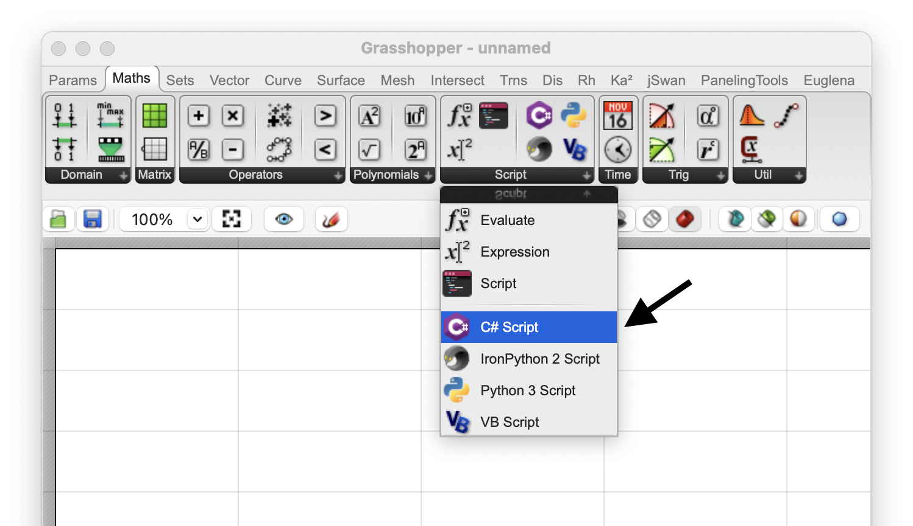
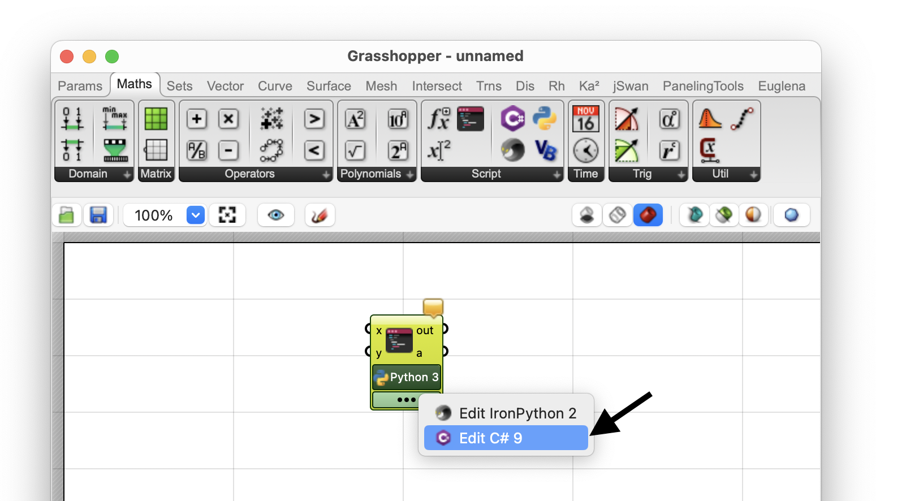
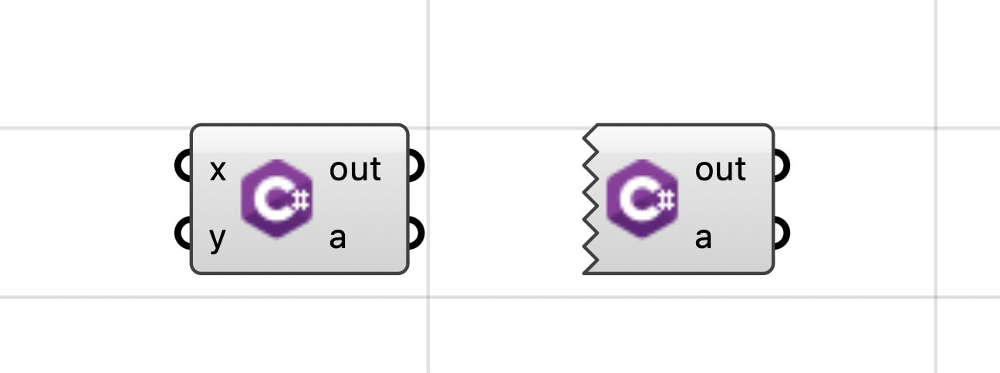
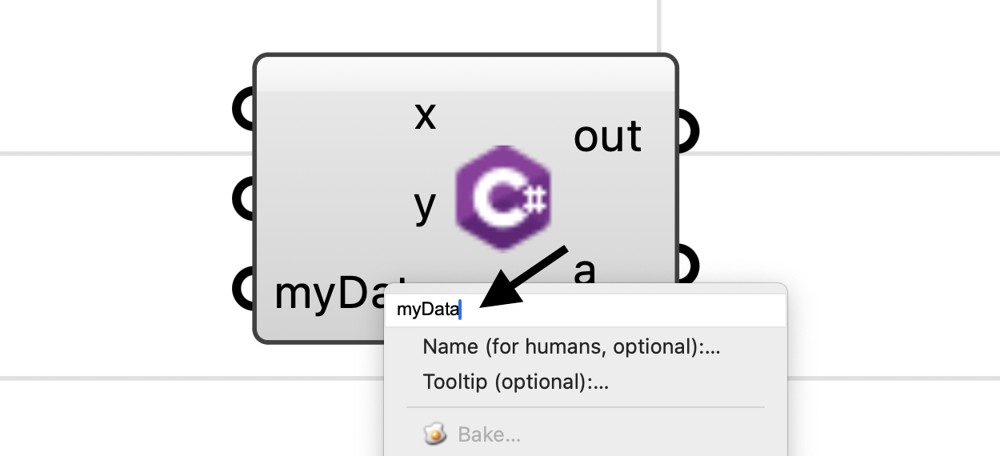
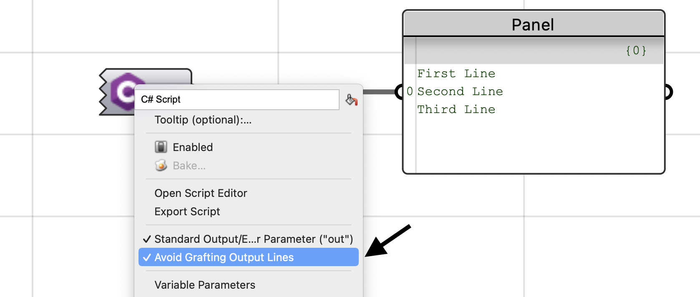

+++
title = "Grasshopper Scripting: C#"
description = ""
type = "guides"
categories = ["Scripting"]
keywords = [ "", "" ]
languages = [ "C#" ]
authors = ["ehsan"]
sdk = [ "RhinoCommon" ]
weight = 4

[included_in]
platforms = [ "Windows", "Mac" ]
since = 8

[page_options]
byline = true
toc = true
toc_type = "single"
block_webcrawlers = false
+++

<style>
    .main-content img { zoom: 50%; }
    code {
        background-color: #efefef;
        padding-left: 5px;
        padding-right: 5px;
        border-radius: 3px;
        font-size: 14px;
    }
</style>


This guide is meant to be a detailed reference on all the important aspects and features of the Grasshopper C# Script component. If you would like a quick introduction to the script component, please check out:

[Grasshopper Script Component](/guides/scripting/scripting-component)

This guide does not discuss Rhino or Grasshopper APIs either. So if you would like to know how to create complex geometries in Rhino and Grasshopper, please check out:

[Essential Guide to C# Scripting in Grasshopper - by Rajaa Issa](https://developer.rhino3d.com/guides/grasshopper/csharp-essentials)



Let's dive into C# scripting in Grasshopper by creating a Script component. Go to the **Maths** tab and **Script** panel and drop a C# Script component onto the canvas:



You can also use the generic Script component that can run any language, and choose C# from the [ ● ● ● ] menu:



### Opening Script Editor

Now we can double-click on the component to open a script editor. Note that the component draws a cone pointing to the editor that is associated with this component.


### Component Options

At any time, you can right-click on a script component to access a few options that would change how the component behaves. We will discuss all these options in detail below.


### Inputs, Outputs

The most important concept on a script component is the inputs/outputs. The **Script** component supports *Zoomable User Interface* (*ZUI* for short). TThis means that you can modify the inputs and outputs of the component by zooming in until the **Insert** [ ⊕ ] and **Remove** [ ⊖ ] controls are visible on either side:


By default a script component will have `x` and `y` inputs, and `out` and `a` as outputs. When all parameters on either side are removed, the component will draw a jagged edge on that side. This is completely okay as not all scripts require inputs or produce values on the other output:



Every time you add a parameter, a new temporary name is assigned to it. You can right-click on the parameter itself, to edit the name. It is good practice to assign a meaningful name to parameters so others can understand what kind of inputs to pass to your component or what these inputs are gonna be used for.



### Reserved Names

Every programming language has a set of reserved words (or keywords) that are used in its language constructs. For example in C#, the words `return`, `decimal`, or `default` are all reserved. The C# script component does not allow using any of these keywords for input or output parameters:


Check out [C# Keywords](https://learn.microsoft.com/en-us/dotnet/csharp/language-reference/keywords/) for more information on these keywords.

### Standard Output (out)

The `out` output parameter is special. It captures anything that the script prints to the console (`Console.WriteLine`). The captured output is passed to this parameter as one string or multiple strings (one for each line). The default behaviour is that each line being printed to the console, becomes one item in the `out` parameter:


You can control the single vs multi-line behaviour using the **Avoid Grafting Output Lines**. When this option is checked, all the console output will be passed as one single item to the `out` parameter.



### Type Hints

C# is a strongly-typed language. More often than not we need to define the types of inputs and outputs to be able to use all their associated features. For example, C# knows how to add two integers (`int`) together, so if we are going to add inputs in the script, we would need to define a type that supports the addition.

This is where *Type Hints* come into play. They define the type of input or output parameter while also act as data type converters. For example you can pass a *Line* to an input of type `integer` and the converter would capture the length of the line and pass that as the integer to the component. The conversions are identical to how Grasshopper parameters can convert to each other.

By default all inputs and outputs of a C# component have **No Type Hint** meaning they are defined as type `object` in the script. This provides a lot of flexibility but if you pass two integers to the default `x` and `y` inputs, this script below would fail as C# does not know how to add two `object`s to each other.

```csharp
a = x + y;
```


There are plenty of *Type Hints* to choose from. They are available on both input and output parameters:


Check out [Type Hints](/guides/scripting/scripting-gh-typehints) for more information on these type hints and their use cases.

### Extracting Parameters

### SDK-Mode (GH_ScriptInstance)

#### RunScript Signature

#### Before, After

#### Draw Methods

### C# Scripts

### NuGet Packages

### Marshalling Outputs

### Editor Features

#### Grasshopper Menu

#### Layout Toggles

#### Layout Options

### Script Options

- exporting

### Advanced

#### Special Inputs

- script
- library
  
#### Special Outputs

- script

#### Advanced Options

- discard caches
- 

